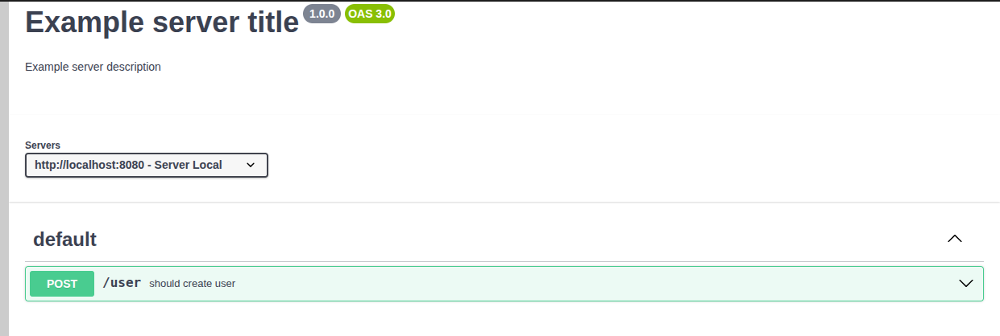

# Perry - Swagger generator library using e2e tests

---

## Summary

### [Setup](#setup)
### [Creating Tests](#creating-tests)
### [Usage examples](#usage-examples)
### [Doing assertions](#doing-assertions)

---

# Setup

#### Install the library:

```shell
composer require n4m-ward/laravel-perry
```

#### Run the following command once to generate the configuration files

```shell
./vendor/bin/perry
```

After running the command above, two files will be created

- A `perry.json` file containing the following data:

```json
{
    "testsFolderPath": "/tests/Perry",
    "testExecutorPath": "/vendor/bin/phpunit",
    "swaggerOutputPath": "/perry_output/swagger",
    "cacheOutputPath": "/perry_output/cache"
}
```

- A `BaseTestCase.php` file that you will extend in your e2e tests
- The `BaseTestCase` will be created in the following path: `/tests/Perry/BaseTestCase.php`
- You can change the path of this file if you want, or use your own `BaseTestCase`

```php
<?php

namespace Tests\Perry;

use Perry\Attributes\Info;
use Perry\Attributes\Server;
use Perry\Attributes\Servers;
use Perry\PerryHttp\PerryHttpRequest;
use Illuminate\Foundation\Testing\TestCase as LaravelTestCase;

#[Servers(
    new Server(description: 'Example server local', url: 'http://localhost:8000')
)]
#[Info(
    version: '1.0.0',
    title: 'Example server title',
    description: 'Example server description',
)]
abstract class BaseTestCase extends LaravelTestCase
{
    use PerryHttpRequest;
}

```

---

# Creating Tests

- First, create a class extending the `BaseTestCase` created above
- For example, an `UserControllerTest`

- Then let's create our first e2e test

```php
public function test_shouldCreateUser() {
    $this
        ->perryHttp()
        ->withBody([
            'name' => 'John Doe',
            'age' => 25,
            'email' => 'john@doe.com',
            'password' => 'password',
        ])
        ->post('/user')
        ->assertJson(['success' => true])
        ->assertStatus(Response::HTTP_CREATED);

    $this->assertDatabaseHas('users', [
        'name' => 'John Doe',
        'age' => 25,
        'email' => 'john@doe.com',
    ]);
}
```

- Then run the following command

```shell
./vendor/bin/perry
```

- So, the following documentation will be created on the path `perry_output/swagger/output.yaml`

```yaml
openapi: 3.0.0
servers:
    - { description: 'Server Local', url: 'http://localhost:8080' }
info:
    version: 1.0.0
    title: 'Example server title'
    description: 'Example server description'
paths:
    /user: { post: { summary: 'should create user', description: 'should create user', operationId: test_shouldCreateUser, responses: { 201: { description: '201', content: { application/json: { schema: { type: object, properties: { success: { type: boolean, example: true } } } } } } }, requestBody: { description: 'should create user', content: { application/json: { schema: { type: object, properties: { name: { type: string, example: 'John Doe' }, age: { type: integer, format: int32, example: 25 }, email: { type: string, example: john@doe.com }, password: { type: string, example: password } } } } } } } }

```



---

# Usage examples

### Request using header

```php
public function test_exampleWithHeaders(): void
{
    $this
        ->perryHttp()
        ->withHeaders([
            'Authorization' => 'Bearer token',
        ])
        ->get('/api/example');
}
```

### Request using body

```php
public function test_exampleWithHeaders(): void
{
    $this
        ->perryHttp()
        ->withBody([
            'foo' => 'bar',
        ])
        ->post('/api/example');
}
```


### Request using body and headers

```php
public function test_exampleWithHeadersAndBody(): void
{
    $this
        ->perryHttp()
        ->withHeaders([
            'Authorization' => 'Bearer token',
        ])
        ->withBody([
            'foo' => 'bar',
        ])
        ->post('/api/example');
}
```

### Available http methods

```php
public function test_get(): void
{
    $this->perryHttp()->get('/api/example/123');
}

public function test_post(): void
{
    $this
        ->perryHttp()
        ->withBody(['foo' => 'bar'])
        ->post('/api/example');
}

public function test_put(): void
{
    $this
        ->perryHttp()
        ->withBody(['foo' => 'bar'])
        ->put('/api/example/123');
}

public function test_patch(): void
{
    $this
        ->perryHttp()
        ->withBody(['foo' => 'bar'])
        ->patch('/api/example/123');
}

public function test_delete(): void
{
    $this->perryHttp()->delete('/api/example/123');
}
```

# Doing assertions

- **The method `perryHttp()` will return an `Illuminate\Testing\TestResponse`**
- With the `TestResponse`, we can do some assertions as we can see bellow
- You can see all available assertions for `TestResponse` [Clicking here](https://laravel.com/docs/11.x/http-tests)

```php
public function test_shouldMakeHttpRequest_AndValidateResponseBody(): void
{
    $this
        ->perryHttp()
        ->get('/user/123')
        ->assertJson([
            'name' => 'John Doe',
            'age' => 25,
            'email' => 'john@doe.com',
            'password' => 'password',
        ])
        ->assertStatus(Response::HTTP_OK);
}

public function test_shouldDoHttpRequest_AndValidateIsUnauthorized(): void
{
    $this
        ->perryHttp()
        ->delete('/user/123')
        ->assertJson([
            'message' => 'Unauthorized',
        ])
        ->assertUnauthorized();
}
```
